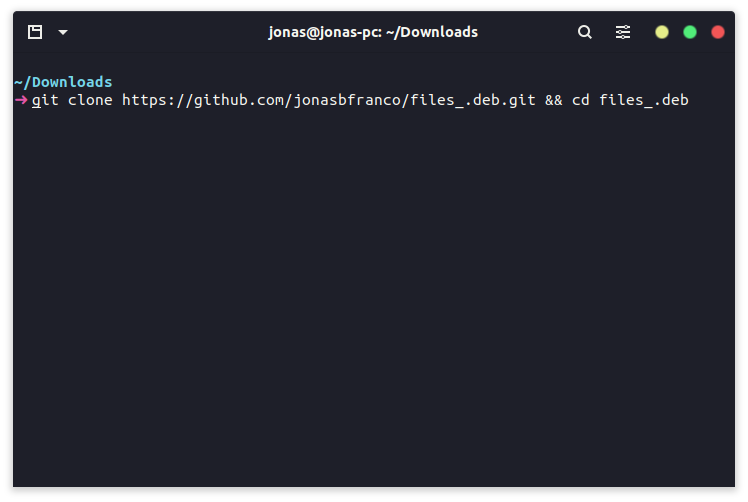
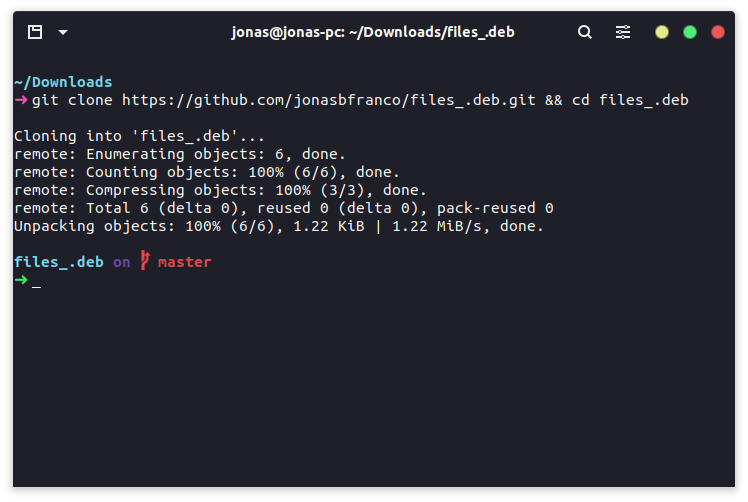
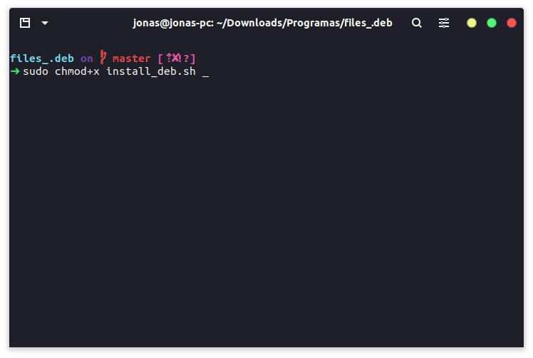
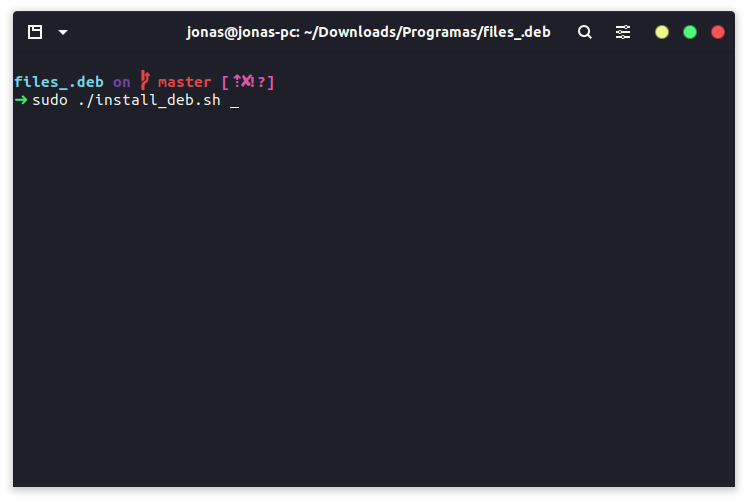
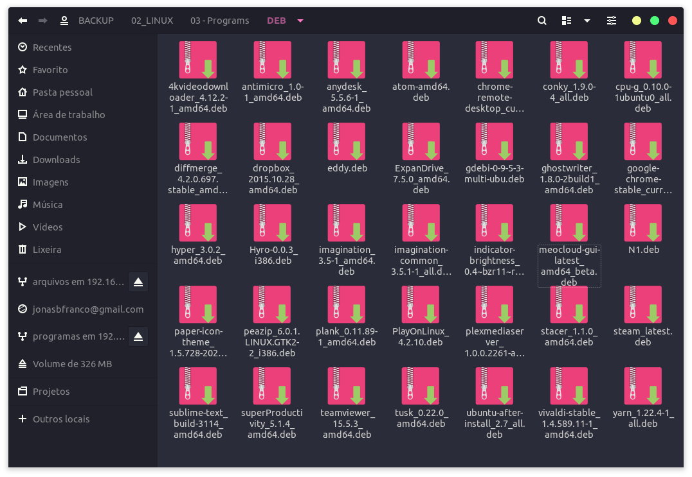

# 🐧 🖥 🇧🇷 🇺🇲
# Instale arquivos .deb no Ubuntu com o script install_deb.sh
# Install .deb files on Ubuntu with the install_deb.sh script


```

$git clone https://github.com/jonasbfranco/files_.deb.git && cd files_.deb

```





```

$sudo chmod +x install_deb.sh

```



```

$ sudo ./install_deb.sh

```



<br>


#### ⏳ Aguadar o processo de instalação - Wait for the installation process
***

<br>

## 📦📦 Programas na pasta
## 📦📦 Programs in folder

- cpu-g_0.10.0-1ubuntu0_all.deb
- dropbox_2015.10.28_amd64.deb
- ghostwriter_1.8.0-2build1_amd64.deb
- hyper_3.0.2_amd64.deb
- plank_0.11.89-1_amd64.deb
- stacer_1.1.0_amd64.deb
- steam_latest.deb
- yarn_1.22.4-1_all.deb

<br>

## 🏷 Notas
## 🏷 Notes

> 👨‍💻 👩‍💻 Você pode baixar mais arquivos .deb e inserir na pasta deb/ que esta extraída em seu pc, que o script vai instaçlar normalmente.
> 
> 👨‍💻 👩‍💻 You can download more .deb files and insert deb/ folders that are extracted on your PC, the script starts normally.

<br>

> 📥 - Baixei mais arquivos .deb e inseri em minha pasta no meu pc.
> 
> 📥 -I downloaded more .deb files and inserted them in my folder on my pc.

<br>

## 📦 Minha pasta com mais arquivos
## 📦 My folder with more files

